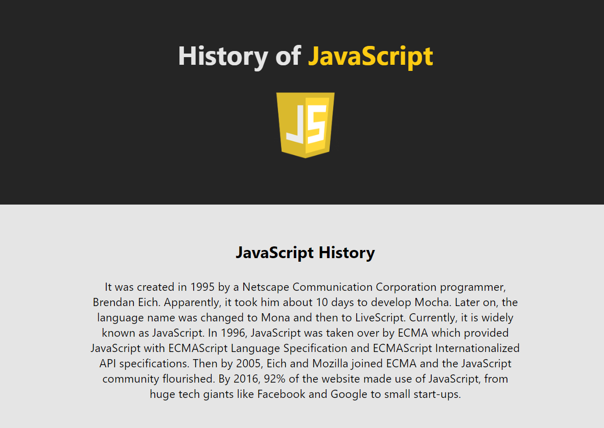
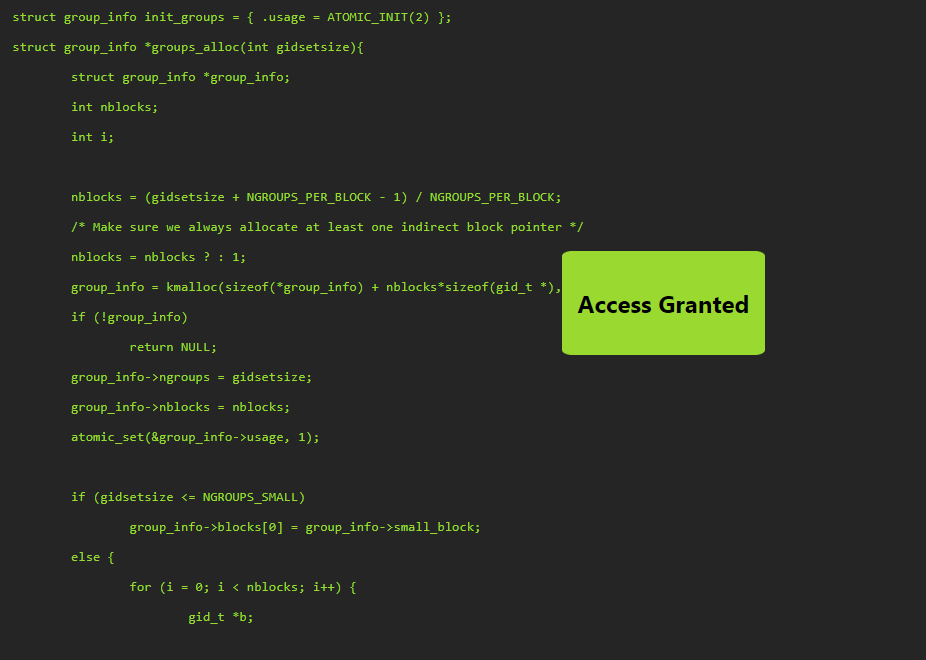
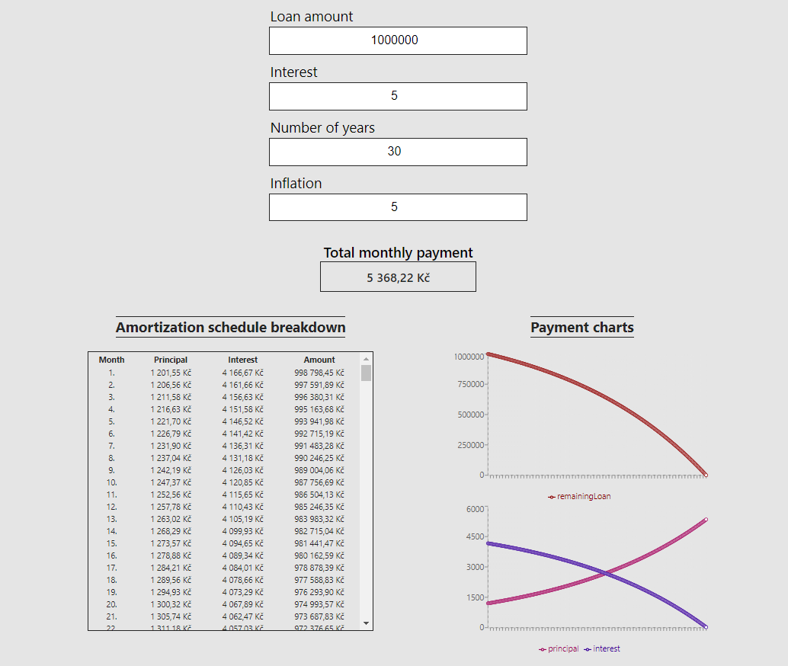
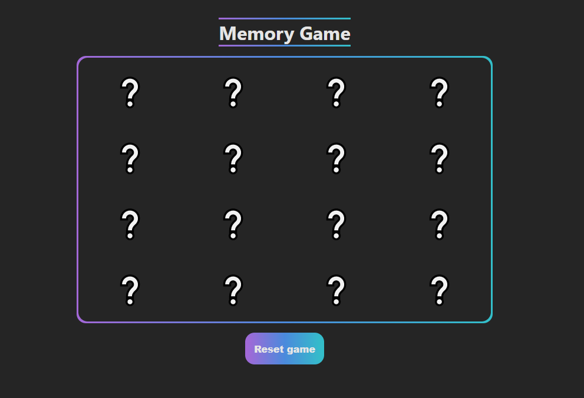

# ITA 2022 React

## React Apps

### JavaScript Web

A simple static web page about JS history.

### To-do List - Redux

A simple To-do application with Redux, where you can add, delete, filter, tasks are saved in local storage.

### HackerTyper Clone

A simple HackerTyper clone.

### Mortgage Calculator

A simple Mortgage Calculator, where you can see monthly payments, remaining loan amount, interest, principal.

### Memory Game

A simple Memory Game with cats.

### Blog

A simple blog application, where you can add, delete, edit articles. Backend file system.

