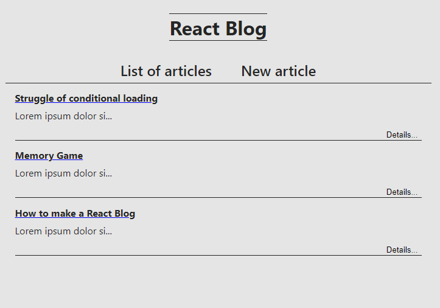

# Blog

Blog web application made with React, React hooks and web application framework
Express.js for communicating with backend. User is able to create articles, if the
conditions are met => input fields can not be empty, click on individual articles
from the list to look at the full version, from this point it is possible to delete or
edit them. Due to the use of async functions and fetching, cards with "Loading...",
or error messages are displayed.

